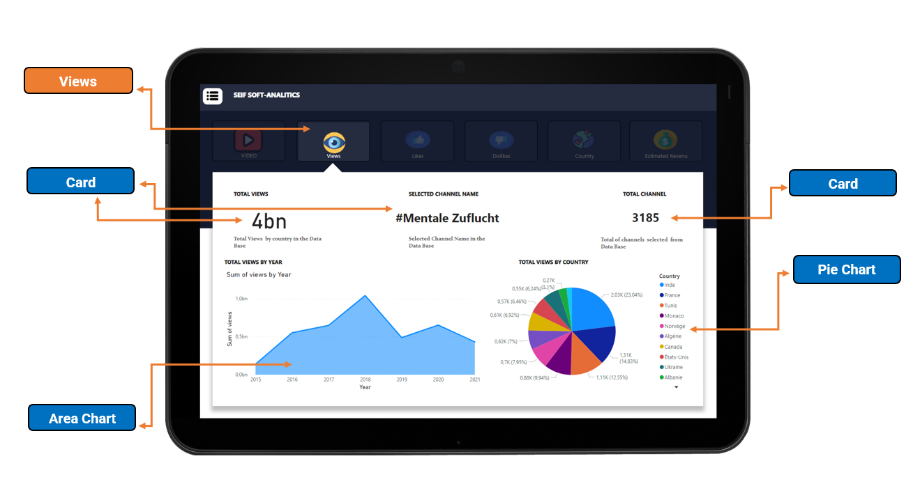
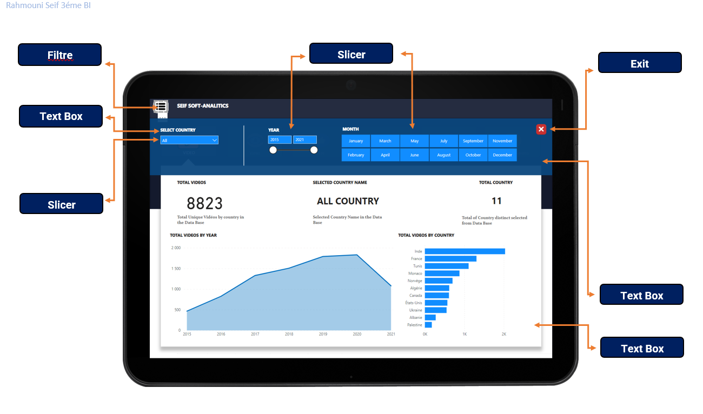

# POWER-BI-SEIF-ANALYSTICS
Our Dashboard will be used to develop several visualizations:
Analytical data of the channel: evolution of the number of Likes, dislikes as well as the number of views and the number of videos.
Revenue estimate: revenue estimate for YouTube channels based on the number of views for all videos produced by a channel.
Evolution of YouTube channels: comparison between the states of a channel in an instant T and T+1
Grouping of YouTube channels: grouping according to videos, views, likes, dislikes, country, revenue estimate.

